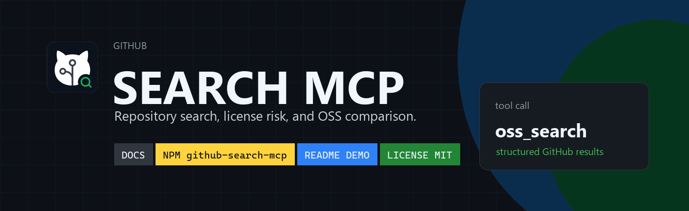
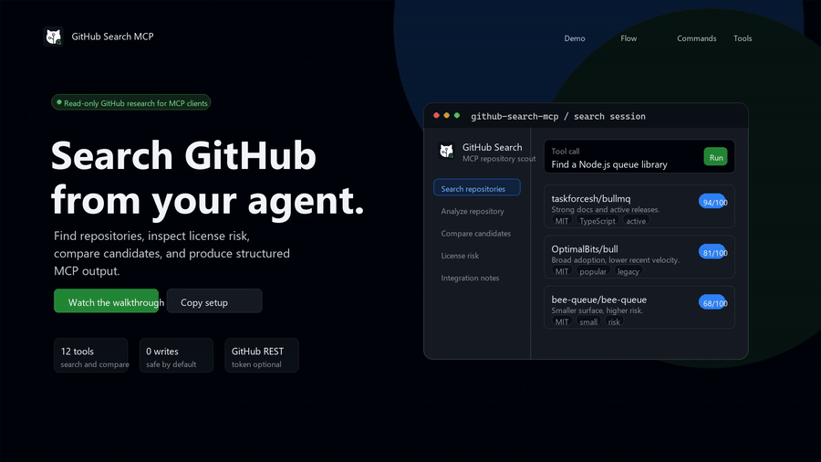

# GitHub Search MCP

<p align="center">
  <a href="demo/index.html">Demo page</a> |
  <a href="media/github-search-mcp-walkthrough.mp4">Play full MP4</a> |
  <a href="DESIGN.md">Design system</a> |
  <a href="SECURITY.md">Security</a>
</p>

<p align="center">
  
  
  
  
</p>

**GitHub Search MCP** is a read-only Model Context Protocol server for repository
research. It lets an MCP client search GitHub, inspect license and maintenance
risk, compare open-source candidates, and generate practical integration notes.

It is built for the moment when an agent asks: _Which repository should I use,
why, and what should I check before I adopt it?_

## Demo videos

The preview below is an animated GIF. Use the MP4 link for the full walkthrough.

| GitHub Search MCP walkthrough                                                                                                        |
| ------------------------------------------------------------------------------------------------------------------------------------ |
| [](media/github-search-mcp-walkthrough.mp4) |
| First-run flow: install command, MCP client config, GitHub search, repository comparison, and integration notes.                     |
| [Play full MP4](media/github-search-mcp-walkthrough.mp4) · [Repo file](demo/github-search-mcp-demo.mp4) · 30s · 1920x1080 · 30fps    |

Brand and video source files live under `assets/brand`, `demo`, `media`, and
`scripts`. The visual system is documented in [`DESIGN.md`](DESIGN.md).

---

## Why this is useful

Choosing an open-source dependency is not just search. You need relevance,
license safety, maintenance health, documentation quality, adoption signals,
package metadata, and clear next steps. GitHub Search MCP gives your client a
structured, read-only research loop for that decision.

| Capability           | What the agent gets                                                                            |
| -------------------- | ---------------------------------------------------------------------------------------------- |
| Repository search    | GitHub results filtered by intent, language, topics, stars, freshness, and license preference. |
| License and risk     | SPDX detection, permissive-license preference, unknown-license warnings, and repo-risk flags.  |
| Repository analysis  | README, tree, package signals, docs quality, maintenance velocity, and adoption indicators.    |
| Candidate comparison | Ranked options with explainable scoring instead of a loose list of links.                      |
| Integration notes    | Install commands, important files, usage steps, caveats, and review reminders.                 |

## Quick start

Run without installing:

```bash
npx github-search-mcp
```

Or install globally:

```bash
npm install -g github-search-mcp
github-search-mcp
```

Use a token when you want higher GitHub API limits:

```bash
GITHUB_TOKEN=ghp_xxx npx github-search-mcp
```

The server speaks MCP over `stdio` by default.

## MCP client config

```json
{
  "mcpServers": {
    "github-search": {
      "command": "npx",
      "args": ["-y", "github-search-mcp"],
      "env": { "GITHUB_TOKEN": "" }
    }
  }
}
```

Optional HTTP transport:

```bash
github-search-mcp --transport http --port 7345
# Streamable HTTP endpoint: http://127.0.0.1:7345/mcp
```

The legacy `oss-research-mcp` binary is kept as an alias for compatibility.

## Tools

The product is named GitHub Search MCP. Tool names keep the tested `oss_` prefix
for API compatibility.

| Tool                                | Purpose                                                                     |
| ----------------------------------- | --------------------------------------------------------------------------- |
| `oss_search_repositories`           | Search GitHub repositories by query and filters.                            |
| `oss_get_repository_profile`        | Basic repository metadata.                                                  |
| `oss_get_repository_tree`           | File and directory tree of a branch.                                        |
| `oss_read_repository_file`          | Read a single text file, with binary rejection and truncation guards.       |
| `oss_get_readme`                    | Fetch the README.                                                           |
| `oss_check_license`                 | Detect license and classify rights and risk.                                |
| `oss_analyze_repository`            | Full profile, license, docs, maintenance, package signals, risk, and score. |
| `oss_compare_repositories`          | Score and rank multiple repositories.                                       |
| `oss_find_open_source_alternatives` | Find ranked OSS alternatives for a target or use case.                      |
| `oss_generate_integration_notes`    | Read-only integration notes for adopting a repo.                            |
| `oss_deepwiki_summary`              | Optional DeepWiki summary for a repo.                                       |
| `oss_health_check`                  | Server status, version, cache backend, and rate limit.                      |

## Example tool calls

Find alternatives to a paid API:

```json
{
  "name": "oss_find_open_source_alternatives",
  "arguments": {
    "target": "Stripe",
    "useCase": "payment processing for a small SaaS",
    "mustBeFree": true,
    "mustBeSelfHosted": true,
    "licensePreference": "avoid-strong-copyleft"
  }
}
```

Compare libraries:

```json
{
  "name": "oss_compare_repositories",
  "arguments": {
    "repositories": ["expressjs/express", "fastify/fastify", "koajs/koa"],
    "criteria": { "preferActiveMaintenance": true, "preferPermissiveLicense": true }
  }
}
```

## Configuration

Configure via environment variables (see [`.env.example`](.env.example)) and/or
an optional config file at `~/.github-search-mcp/config.json`. CLI flags override
both.

| Variable                     | Default                             | Description                                                |
| ---------------------------- | ----------------------------------- | ---------------------------------------------------------- |
| `GITHUB_TOKEN`               | _(unset)_                           | Optional token for higher rate limits. Read from env only. |
| `OSS_MCP_TRANSPORT`          | `stdio`                             | `stdio` or `http`.                                         |
| `OSS_MCP_PORT`               | `7345`                              | HTTP port.                                                 |
| `OSS_MCP_CACHE_ENABLED`      | `true`                              | Enable response caching.                                   |
| `OSS_MCP_CACHE_PATH`         | `~/.github-search-mcp/cache.sqlite` | SQLite cache path.                                         |
| `OSS_MCP_CACHE_TTL_HOURS`    | `24`                                | Cache TTL in hours.                                        |
| `OSS_MCP_DEEPWIKI_ENABLED`   | `false`                             | Optional DeepWiki adapter.                                 |
| `OSS_MCP_MAX_RESULTS`        | `20`                                | Default max search results.                                |
| `OSS_MCP_REQUEST_TIMEOUT_MS` | `15000`                             | Outbound request timeout.                                  |
| `OSS_MCP_LOG_LEVEL`          | `info`                              | `debug`, `info`, `warn`, or `error`.                       |

## Security notes

- **Read-only**: no issue, PR, commit, file writes, or shell execution.
- **Domain allowlist**: outbound HTTPS only to `api.github.com`,
  `raw.githubusercontent.com`, and `mcp.deepwiki.com` when DeepWiki is enabled.
- **Untrusted content**: READMEs, file contents, descriptions, and topics are
  returned as data and must not be treated as instructions.
- **Secret hygiene**: the GitHub token is read only from an environment variable
  and is never logged, cached, or returned in tool output.
- **HTTP transport**: binds to loopback by default and rejects untrusted `Host`
  headers. Do not expose it publicly without an authenticating proxy.

See [SECURITY.md](SECURITY.md) for the full policy and reporting process.

## License

[MIT](LICENSE), simple and permissive.
