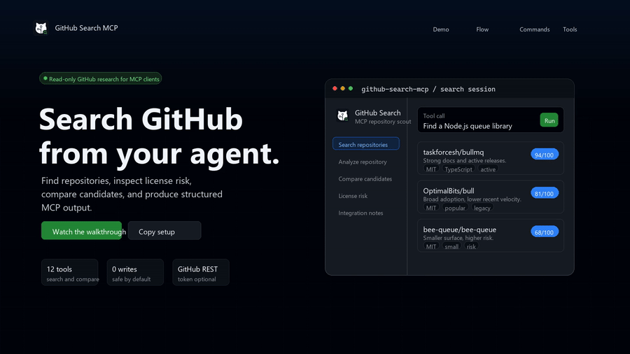
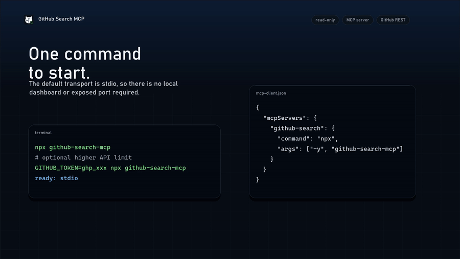

# GitHub Search MCP demo

This directory contains the public user-experience demo for GitHub Search MCP:

- `index.html` is a static, browser-openable product walkthrough.
- `github-search-mcp-pitch.mp4` is the project pitch video.
- `github-search-mcp-setup.mp4` is the setup and usage walkthrough.
- `github-search-mcp-demo.mp4` is a compatibility copy of the setup walkthrough.
- `assets/pitch-poster.png` and `assets/setup-poster.png` are the video posters.
- `assets/demo-poster.png` is a compatibility copy of the setup poster.
- `assets/github-search-logo-*.png` are the app icon variants.

## GitHub previews

| Project pitch                                                          | Setup walkthrough                                                          |
| ---------------------------------------------------------------------- | -------------------------------------------------------------------------- |
|  |  |
| [`github-search-mcp-pitch.mp4`](github-search-mcp-pitch.mp4)           | [`github-search-mcp-setup.mp4`](github-search-mcp-setup.mp4)               |

Open the page directly:

```powershell
Start-Process .\demo\index.html
```

Regenerate the video and logo variants:

```powershell
python .\scripts\render-demo-video.py
python .\scripts\render-readme-assets.py
```

The renderer requires Pillow and FFmpeg to be available on the machine.
